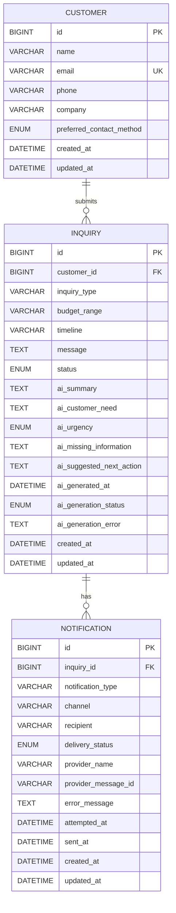

# ER Diagram

## Mermaid ER Diagram

## Relationship Explanation

Customer to Inquiry:

- One Customer may submit many Inquiries.
- Every Inquiry belongs to exactly one Customer.
- A Customer may exist before or without an Inquiry, but an Inquiry cannot exist without a Customer.

Inquiry to Notification:

- One Inquiry may have many Notification records.
- Every Notification belongs to exactly one Inquiry.
- A Notification represents an outbound notification attempt, not a notification-sending service.
- `sent_at` means the email provider accepted the message request. It does not guarantee final recipient delivery.

## Inquiry Submission Transaction Rule

Customer lookup or creation and Inquiry creation must happen in one database transaction.

- They must either both succeed or both roll back.
- AI generation happens only after the Customer and Inquiry transaction commits.
- Email notification happens only after the Customer and Inquiry transaction commits.
- AI or email failure must never roll back the stored Inquiry.

## Cardinality

| Relationship | Cardinality | Meaning |
| --- | --- | --- |
| Customer to Inquiry | 1-to-many | A customer can submit multiple inquiries over time. |
| Inquiry to Notification | 1-to-many | An inquiry can trigger multiple outbound notification attempts. |

## Deletion Rules

- Do not delete a Customer while it has related Inquiries.
- Do not delete an Inquiry while it has related Notifications.
- Use `archived` status for inquiries that should no longer appear as active.
- Avoid soft deletion columns in the MVP unless a future compliance requirement makes them necessary.

## AI Output Modeling Note

AI output is stored with the Inquiry for the MVP because it is derived review context for a submitted inquiry.

It is not modeled as a separate business domain because:

- The MVP has only one AI output contract.
- The dashboard needs the AI context together with the inquiry.
- AI output must never replace the original customer message.
- AI generation failure must not block inquiry creation.
- A separate AI table would add joins and lifecycle complexity before the product needs AI history, prompt versioning, or multiple AI runs.

Future versions may introduce separate AI generation records if the product needs audit history, multiple generation attempts, model comparison, or prompt version tracking.

For the MVP, AI generation starts as `pending` and then transitions to either `succeeded` or `failed`.

## Inactive Future Domain

Attachment is documented elsewhere as a future-ready domain, but it is not an active MVP table.

Attachment upload should be introduced only when file handling, storage, preview, safety checks, and related workflow requirements are intentionally planned.
